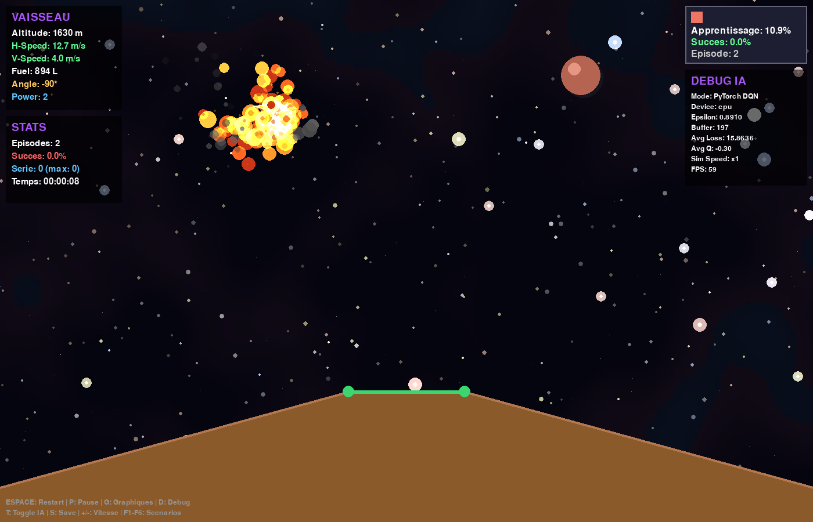

# Mars Lander IA

> [!WARNING]
> **Projet arrêté.** Ce projet n'est plus développé ni maintenu, et les issues et pull requests risquent de rester sans réponse. Le code reste disponible sous licence MIT : n'hésitez pas à le forker pour le reprendre à votre compte.
>
> *This project is no longer maintained. Feel free to fork it.*

Un simulateur d'atterrissage sur Mars où une intelligence artificielle apprend seule à poser le vaisseau, par apprentissage par renforcement (Q-Learning, puis Deep Q-Network avec PyTorch).

*A Mars landing simulator where an AI learns to land by itself through reinforcement learning (tabular Q-Learning and a PyTorch Deep Q-Network). The code and comments are in French.*




Idée originale : **Florent Lannois**. Inspiré du puzzle [Mars Lander](https://www.codingame.com/training/medium/mars-lander-episode-2) de CodinGame.

## Installation

Python 3.10 ou plus récent.

```bash
git clone https://github.com/PierreTzt/mars_lander.git
cd mars_lander
python -m venv .venv
source .venv/bin/activate        # Windows : .venv\Scripts\activate
pip install -r requirements-pro.txt
```

`requirements-pro.txt` installe PyTorch, nécessaire à la version PRO. Pour les autres versions seulement, `requirements.txt` suffit (pygame, numpy, Pillow).

## Lancer le jeu

```bash
python lancer.py            # version PRO
python lancer.py deluxe     # ou : classique, v2, ultimate
```

| Version | Ce qu'elle apporte |
|---------|--------------------|
| `pro` (recommandée) | Deep Q-Network PyTorch, graphiques d'apprentissage en temps réel, rendu soigné |
| `classique` | Q-Learning avec table, la version d'origine |
| `v2` | 20 fonctionnalités : planètes, météorites, mode nuit, algorithme génétique, éditeur de niveaux... |
| `ultimate` | Effets visuels avancés, progression de l'IA visible |
| `deluxe` | Menu, 17 succès à débloquer, cartes de chaleur des crashs et atterrissages |

Les versions sont indépendantes : chacune a sa propre boucle de jeu, mais toutes partagent le moteur du dossier `lander/`.

## Commandes

| Touche | Action | Versions |
|--------|--------|----------|
| Espace | Relancer un épisode | toutes |
| + / - | Vitesse de simulation | toutes |
| P | Pause | toutes sauf `deluxe` |
| F1 à F6 | Changer de scénario (terrain) | `pro`, `classique`, `v2` |
| Échap | Quitter (retour au menu dans `deluxe`) | `pro`, `ultimate`, `deluxe` |

Version `pro` : **G** ouvre les graphiques temps réel, **T** bascule entre DQN et Q-Learning, **D** affiche le panneau de debug, **S** sauvegarde le modèle.

Version `classique` : quand `ia_active = False` dans `lander/data.py`, on pilote avec les flèches (rotation) et 1 à 5 (puissance). **V** active le vent, **T** la trajectoire prédite, **S** les sons.

Version `v2` : la liste complète des touches s'affiche dans la console au lancement (sons, vent, nuit, météorites, brouillard, caméra, tempêtes, power-ups, export GIF, éditeur, tableau de bord, modes Time Attack / Survie / Missions, choix de la planète avec 1 à 6).

Version `deluxe` : **H** affiche les cartes de chaleur.

## Comment l'IA apprend

À chaque image, l'agent observe l'état du vaisseau, choisit une action (un angle entre -90° et +90° et une puissance de 0 à 4), puis reçoit une récompense : positive s'il se rapproche de la zone d'atterrissage ou s'y pose en douceur, négative s'il s'en éloigne ou s'écrase.

Un atterrissage réussit si le vaisseau touche la zone plate avec un angle nul, une vitesse verticale inférieure ou égale à 40 et une vitesse horizontale inférieure ou égale à 20.

**Q-Learning (versions classique, ultimate, deluxe)** : l'état est discrétisé et l'agent remplit une table de valeurs Q avec l'équation de Bellman :

```
Q(s, a) ← Q(s, a) + α · (r + γ · max Q(s', a') − Q(s, a))
```

**Deep Q-Network (version PRO)** : un réseau de neurones remplace la table et prend en entrée l'état continu (position, vitesses, carburant, angle, distance à la zone). Il combine :

- une architecture *Dueling*, qui sépare la valeur de l'état et l'avantage de chaque action ;
- le *Double DQN*, qui limite la surestimation des valeurs Q ;
- un replay prioritaire, qui rejoue plus souvent les expériences où l'erreur est grande ;
- une mise à jour douce du réseau cible, pour stabiliser l'entraînement.

L'exploration (epsilon) part de 0,9 et diminue à chaque épisode : l'agent agit surtout au hasard pendant les premières centaines d'épisodes, puis exploite ce qu'il a appris. Utilisez **+** pour accélérer la simulation.

**Algorithme génétique (version v2)** : une population de « pilotes » est évaluée, les meilleurs sont croisés et mutés à chaque génération.

## Sauvegardes

Tout ce que le jeu enregistre va dans `saves/`, qui n'est pas suivi par git :

- `qtable_<date>.pkl` : la Q-table, rechargée au lancement suivant (la plus récente est gardée) ;
- `pytorch_model.pth` : le modèle de la version PRO ;
- `achievements.json`, `dqn_model.pkl`, `genetic_population.pkl`, GIF exportés...

Supprimez le dossier pour repartir de zéro.

## Configuration

`lander/data.py` regroupe les réglages : hyperparamètres du Q-Learning (`alpha`, `gamma`, `epsilon`, `epsilon_decay`), mode IA ou manuel (`ia_active`), scénarios de terrain, et activation des fonctionnalités de la v2 (`meteorites_actif`, `mode_nuit_actif`, `planete_actuelle`, etc.).

## Structure du projet

```
lancer.py           Point d'entrée : python lancer.py <version>
versions/           Les 5 versions jouables (une boucle de jeu chacune)
lander/             Moteur partagé
  data.py             Configuration, scénarios, constantes
  vaisseau.py         Physique du vaisseau
  surface.py          Terrain et zone d'atterrissage
  jeu.py              Règles, collisions, actions possibles
  affichage.py        Rendu pygame (fond, HUD, particules)
  common.py           Vent, sons, replays
  ia_learning.py      Agent Q-Learning
  pytorch_ai.py       Agent DQN PyTorch (version PRO)
  advanced_ai.py      DQN en numpy, algorithme génétique, planètes (v2)
  game_systems.py     Météorites, dégâts, caméra, power-ups... (v2)
  extra_features.py   Éditeur de niveaux, tableau de bord, export GIF (v2)
  pro_graphics.py     Nébuleuses, particules, terrain procédural (PRO)
  realtime_plots.py   Graphiques matplotlib en temps réel (PRO)
  paths.py            Emplacement du dossier saves/
scripts/            Outils de vérification
saves/              Sauvegardes locales (créé au premier lancement)
```

## Reprendre le projet

Le projet n'étant plus maintenu, le plus simple pour le faire évoluer est d'en faire un fork. Pour vérifier le code après une modification :

```bash
pip install ruff
ruff check .
python scripts/verifier_imports.py
```

La CI GitHub (`.github/workflows/ci.yml`) lance ces mêmes vérifications.

Quelques pistes d'amélioration :

- **Physique plus fidèle à CodinGame** : l'angle et la puissance changent instantanément, alors que le puzzle d'origine limite les variations à ±15° et ±1 par tour.
- **Récompenses du DQN** : l'atterrissage rapporte jusqu'à +1 800 alors que les récompenses intermédiaires sont de l'ordre de ±1 ; les normaliser devrait stabiliser l'apprentissage.
- **Fonctionnalités de la v2 pas encore branchées** : le multijoueur local et les zones d'atterrissage multiples existent dans `lander/game_systems.py` mais ne sont pas reliés à la boucle de jeu.
- **Code dupliqué** : les versions ont chacune leur boucle et leur HUD ; une partie pourrait être mise en commun dans `lander/`.
- **Traduction** : le code et les commentaires sont en français.

## Crédits

- Idée originale : Florent Lannois
- Développement : Pierre Touzet
- Assistance IA : Claude (Anthropic)
- Inspiré par le puzzle Mars Lander de CodinGame

## Licence

[MIT](LICENSE)
